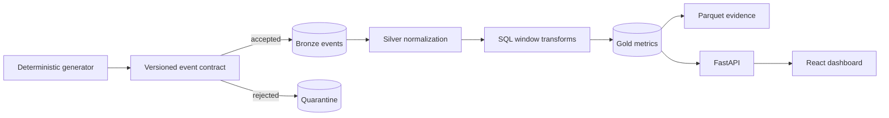

# Player Telemetry Analytics Platform

[](https://github.com/JasonStys/player-telemetry-analytics-platform/actions/workflows/ci.yml)
[](https://github.com/JasonStys/player-telemetry-analytics-platform/actions/workflows/codeql.yml)

A production-style analytics project that turns deterministic synthetic game events into trustworthy
player timelines, sessions, funnels, retention cohorts, progression summaries, and explainable anomaly
candidates. The repository emphasizes data contracts, privacy, lineage, idempotency, testable SQL, and
honest evidence rather than notebook-only analysis.

All included events and identifiers are synthetic. No user, customer, or employer data is used.

## What this demonstrates

- Python ingestion with strict Pydantic contracts, keyed identifier pseudonymization, recursive privacy
  screening, atomic batches, checksum-based replay protection, and reason-coded quarantine.
- SQL-first bronze, silver, and gold transformations in DuckDB, plus PostgreSQL 18 schema validation.
- Window-function sessionization, cohort retention, conversion funnels, progression/reset timelines,
  churn signals, and rules-based anomaly triage.
- Compressed Parquet exports with predicate- and projection-friendly columnar storage.
- A typed FastAPI boundary and an accessible React/TypeScript dashboard with keyboard navigation,
  reduced-motion support, semantic tables, and textual chart equivalents.
- Layered tests, coverage thresholds, linting, strict type checks, dependency audits, CodeQL, container
  builds, a performance budget, and a real browser smoke test.

## Architecture at a glance



The accepted design is a modular monolith with a SQL-first transformation layer. It keeps a complete
local demonstration easy to run while preserving boundaries that could later move to an object store,
orchestrator, or separate warehouse. The decision and alternatives are recorded in
[`docs/adr/0001-sql-first-modular-analytics.md`](docs/adr/0001-sql-first-modular-analytics.md).

## Quick start

Prerequisites: Python 3.12 or 3.13 and Node.js 24 LTS.

```bash
python -m venv .venv
source .venv/bin/activate
python -m pip install -e ".[dev]"
cd web && npm ci && cd ..
./scripts/demo.sh
```

On Windows PowerShell, activate with `.venv\Scripts\Activate.ps1`, then run the individual commands
shown below or use Git Bash for the scripts.

Start the API and dashboard in separate terminals:

```bash
python -m uvicorn telemetry_platform.api:app --reload
cd web && npm run dev
```

Open `http://localhost:5173`. API documentation is available at `http://localhost:8000/docs`.

### Container demonstration

```bash
docker compose up --build
```

The dashboard is served at `http://localhost:4173` and the API at `http://localhost:8000`.

## Pipeline commands

```bash
# Generate valid synthetic events plus three intentional failures.
telemetry-platform generate --with-corruption --output data/generated/events.ndjson

# Load exactly once and rebuild every modeled layer.
telemetry-platform ingest data/generated/events.ndjson \
  --database data/warehouse/telemetry.duckdb --batch-id local-v1

# Export reviewable columnar outputs.
telemetry-platform export --database data/warehouse/telemetry.duckdb \
  --output data/generated/gold

# Measure the declared local performance budget.
telemetry-platform benchmark --report docs/reports/generated/benchmark.json
```

Reusing a batch ID with identical bytes returns the original counts without inserting again. Reusing it
with different bytes raises a conflict. Valid late events remain queryable and receive an explicit
quality flag; invalid, duplicate, or privacy-bearing records enter quarantine and never reach metrics.

## Major feature guide

| Feature            | Implementation                                                       | Evidence                                          |
| ------------------ | -------------------------------------------------------------------- | ------------------------------------------------- |
| Event contract     | Immutable version-one Pydantic model with semantic property checks   | Contract and property tests                       |
| Privacy boundary   | HMAC-SHA-256 pseudonyms plus recursive key/value screening           | Privacy unit and property tests                   |
| Reliable ingestion | Transactional batches, SHA-256 source identity, duplicate quarantine | Replay, conflict, and rollback-oriented tests     |
| Sessionization     | Thirty-minute inactivity boundary with `lag` and cumulative windows  | Out-of-order event test and SQL reconciliation    |
| Retention          | Exact D0/D1/D7 activity by first-seen cohort                         | Golden/reconciliation assertions                  |
| Funnels            | Daily distinct-player stage counts with previous-stage conversion    | Independent source-count checks                   |
| Anomaly review     | Late arrival, completion-without-start, and burst rules              | Rule-specific fixtures; no automated fraud claims |
| Data products      | Summary, cohorts, funnel, player timelines, and Parquet exports      | API, browser, and Parquet read-back tests         |
| Operations         | Health endpoint, bounded queries, runbook, containers, CI            | Smoke tests and hosted workflow artifacts         |

## Verification

Run the complete local gate:

```bash
./scripts/verify.sh
```

The gate formats/checks Python and TypeScript, performs strict type checking, runs unit, property,
integration, and component tests with coverage, audits dependencies, validates documentation and source
headers, regenerates the code index, checks Bash syntax and Compose configuration, and runs the
performance budget. PostgreSQL and browser checks run as dedicated CI jobs.

Measured results are recorded in:

- [`docs/reports/test-summary.md`](docs/reports/test-summary.md)
- [`docs/reports/validation.md`](docs/reports/validation.md)
- [`docs/reports/query-plan.md`](docs/reports/query-plan.md)

## Documentation

| Document                                               | Purpose                                                         |
| ------------------------------------------------------ | --------------------------------------------------------------- |
| [`docs/architecture.md`](docs/architecture.md)         | Boundaries, data flow, deployment model, and trade-offs         |
| [`docs/data-contract.md`](docs/data-contract.md)       | Event fields, semantics, examples, and versioning policy        |
| [`docs/metrics-catalog.md`](docs/metrics-catalog.md)   | Exact definitions, denominators, and limitations                |
| [`docs/api.md`](docs/api.md)                           | Endpoint behavior, parameters, and errors                       |
| [`docs/testing.md`](docs/testing.md)                   | Test pyramid, cases, thresholds, and remaining gaps             |
| [`docs/complexity.md`](docs/complexity.md)             | Big-O analysis and storage/query consequences                   |
| [`docs/file-catalog.md`](docs/file-catalog.md)         | One-line purpose for every authored repository file             |
| [`docs/security-privacy.md`](docs/security-privacy.md) | Threat model, privacy controls, and safe-data policy            |
| [`docs/operations.md`](docs/operations.md)             | Setup, backup, failure recovery, and troubleshooting runbook    |
| [`docs/code-index.md`](docs/code-index.md)             | Generated exact line locations for source symbols and variables |
| [`docs/research.md`](docs/research.md)                 | Primary technical sources and stack-selection rationale         |

## Repository map

| Path                                  | Summary                                                               |
| ------------------------------------- | --------------------------------------------------------------------- |
| `src/telemetry_platform/models.py`    | Versioned event and result contracts                                  |
| `src/telemetry_platform/privacy.py`   | Pseudonymization and sensitive-content screening                      |
| `src/telemetry_platform/generator.py` | Deterministic synthetic workload and corruption fixtures              |
| `src/telemetry_platform/storage.py`   | DuckDB ingestion, quarantine, transformations, plans, and exports     |
| `src/telemetry_platform/metrics.py`   | Bounded dashboard queries and reconciliation surface                  |
| `src/telemetry_platform/api.py`       | FastAPI application and read-only analytics endpoints                 |
| `src/telemetry_platform/cli.py`       | Generate, ingest, rebuild, export, demo, and benchmark commands       |
| `sql/`                                | Reviewed bronze/silver/gold SQL and PostgreSQL schema                 |
| `contracts/`                          | Machine-readable version-one JSON Schema                              |
| `tests/`                              | Python unit, property, integration, API, and performance tests        |
| `web/src/`                            | Typed accessible dashboard and component tests                        |
| `web/e2e/`                            | Real-browser smoke and keyboard-navigation tests                      |
| `scripts/`                            | Repeatable verification, demonstration, and repository checks         |
| `.github/workflows/`                  | Least-privilege CI, CodeQL, and dependency review                     |
| `docs/`                               | Architecture, contracts, metrics, operations, decisions, and evidence |

## Scope and limitations

- Synthetic events are intentionally small enough for a laptop; results do not predict real players.
- “Churn risk” is a transparent inactivity rule, not a trained model or causal claim.
- Anomaly rows are review candidates, not fraud or abuse determinations.
- DuckDB is the executable local analytics engine. PostgreSQL validates durable relational constraints,
  but this version does not claim identical query plans across engines.
- Authentication, live game SDK collection, streaming infrastructure, and personally identifiable data
  are intentionally outside version one.

See [`CONTRIBUTING.md`](CONTRIBUTING.md) for the quality gate and [`SECURITY.md`](SECURITY.md) for safe
reporting. The [latest maintenance audit](docs/reports/maintenance-audit-2026-09-18.md) records
hosted verification and dependency decisions. Released under the [MIT License](LICENSE).
