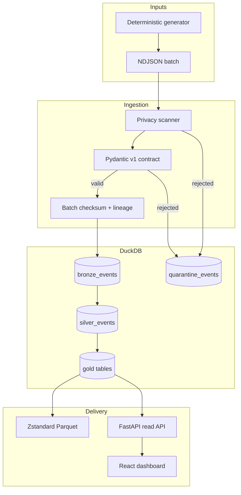

# Architecture

## Goal

Turn untrusted, arrival-ordered synthetic gameplay events into reproducible analytical products while
making validation failures, lineage, definitions, and limitations visible. The system is optimized for a
complete laptop demonstration and reviewable engineering evidence, not production-scale ingestion.

## Constraints

- Only synthetic data may cross the input boundary.
- The pipeline must remain deterministic for a fixed source batch and seed.
- Invalid data must never silently disappear or enter published metrics.
- Metric semantics live in versioned SQL rather than a notebook or dashboard.
- A reviewer must reach a working result without provisioning cloud resources.
- Runtime queries are read-only, bounded, and parameterized.

## Component view

## Data layers

### Raw source

Newline-delimited JSON is the replayable exchange boundary. A SHA-256 digest identifies its exact bytes.
The original payload is preserved in bronze or quarantine with a 20,000-character safety bound.

### Bronze

`bronze_events` contains accepted, typed values plus the original payload, source batch, and late-arrival
flag. `ingestion_batches` records counts and checksum. `quarantine_events` preserves a reason code,
bounded diagnostic, source line, and raw value for every rejected line.

### Silver

`silver_events` adds UTC event dates, arrival lag, and deterministic per-player ordering. No business
metric is calculated here; the layer establishes reusable, normalized event semantics.

### Gold

Gold tables expose sessions, daily measures, retention, funnel stages, player summaries, and anomaly
candidates. Every table is recreated from silver in dependency order, so a rebuild cannot accumulate
stale derived rows.

## Runtime boundaries

- `storage.py` is the only module that executes warehouse SQL.
- `metrics.py` contains bounded use-case queries, not transformation semantics.
- `api.py` opens a short-lived connection for each request and offers only `GET` endpoints.
- The browser knows only the documented API responses and never opens the database.
- PostgreSQL is a CI compatibility boundary for relational schema constraints. DuckDB remains the
  executable analytical source of truth in version one.

## Reliability behavior

1. The whole batch executes in one transaction.
2. An identical batch ID and checksum returns the stored result without rewriting data.
3. A reused batch ID with different bytes raises `BatchConflictError`.
4. Duplicate event IDs are quarantined rather than silently ignored.
5. Late events are accepted when otherwise valid and labeled for downstream review.
6. Gold tables are rebuilt deterministically after successful ingestion.

## Security and privacy boundary

The project assumes every input is untrusted. Pydantic forbids extra fields and enforces identifier,
timestamp, enum, range, and event-specific rules. A recursive screen rejects common personal-data and
credential keys or values before validation. Source identities are converted to keyed HMAC pseudonyms.
The demo key is public and suitable only for synthetic fixtures.

See [`security-privacy.md`](security-privacy.md) for the threat model.

## Deployment

The default Compose model runs an API container, static dashboard container, named DuckDB volume, and an
optional PostgreSQL verification profile. Both application images run unprivileged. The static server
adds basic browser security headers; the API CORS allowlist is explicit.

## Evolution path

If measurements justify it, the same contracts can feed object storage partitions and a managed
warehouse. Transformation SQL should then move behind an adapter or dbt project, while metric definitions
and reconciliation tests remain unchanged. Streaming, authentication, and orchestration are postponed
until a real requirement makes their operational cost worthwhile.
